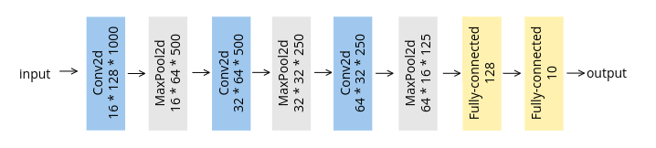
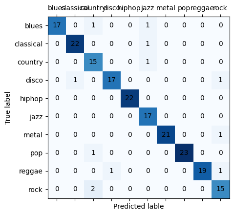

# Music Classificaiton Project
Lingxiao Fang (ID: s5614279)

## Abstract
With the advancement of deep learning technology, music analysis and genre classification have seen significant progress. In this project, I leverage deep neural networks to implement a music classifier and summarize the result of two models.

## Introduction
Music, though as an art, has mathematics behind its patterns, which makes it highly computable. In this project, I employ deep neural networks to process audio data, specifically converting audio files into mel spectrograms. Unlike traditional machine learning approaches that necessitate manual feature extraction, deep learning models such as Convolutional Neural Networks (CNNs) and Residual Networks (ResNets) can automatically learn and classify music genres from these spectrograms.

## Literature Review
Music genres are a traditional category. The music market has a huge database of information and claim to find music for everyone. Many music companies to further develop the way customers discover and follow music. Artificial intelligence is at the centre of their examination. From NLP to collaborative filtering to deep learning, all music platforms make use of AI to categorise music(Kim et al. 2016). Shah et al.(Shah et al. 2022) conducted a comparative analysis of traditional machine learning models and deep learning models (CNN) and proved that CNN is superior to machine learning models.

## Dataset Description

The dataset used in this project is the widely-adopted `GTZAN dataset`, commonly employed for music genre recognition (MGR) research. Comprising 1000 audio tracks, each lasting 30 seconds, this dataset draws from diverse sources, including personal CDs, radio broadcasts, and microphone recordings. It encompasses ten distinct genres, each represented by 100 tracks: blues, classical, country, disco, hip-hop, jazz, metal, pop, reggae, and rock. Researchers and academics frequently use this dataset for tasks such as genre classification, music recommendation systems, and audio signal processing studies. The audio files are provided in the `.wav` format, facilitating their processing using the `librosa` library.

## Model Description
Deep learning obviates the need for manual feature extraction, allowing neural networks to autonomously learn intricate patterns from high-dimensional data. For music classification, I have chosen two deep learning models: `Convolutional Neural Networks` (CNNs) and `Residual Networks` (ResNets).

### CNN
The CNN architecture leverages its inherent representation learning capabilities. This 2D CNN model comprises 3x3 convolutional layers, ReLU activation functions, and 2x2 max-pooling layers. This module is utilized for each layer of the 2D CNN, enabling hierarchical feature extraction.(Minz et al. 2021)The figure below provides the  architecture the CNN network.

### ResNet
To mitigate the gradient vanishing problem frequently encountered in deep CNN models, I employ the ResNet architecture. Residual connectivity is a key innovation in ResNets, allowing the network to bypass one or more layers and directly propagate input to deeper layers. This design enables the network to achieve considerable depth without suffering from gradient vanishing. The ResNet model consists of an initial convolutional layer, batch normalization, max-pooling, and ReLU activation. It further includes multiple stages of residual blocks, each comprising two convolutional layers with batch normalization and ReLU activation, as well as shortcut connections for downsampling when necessary. The model culminates in adaptive average pooling and a fully connected layer. This design, inspired by standard ResNet architectures, optimizes for deep networks and efficient training, rendering it suitable for complex classification tasks. Additionally, the script calculates both total and trainable parameters, providing insights into the model's complexity and capacity.The figure below provides the  architecture the ResNet network.

## Result and Discussion
After training the CNN model, which have suffered from the common issue of gradient vanishing in deep networks, the accuracy results can reach to 0.62. In contrast, the ResNet architecture's ability to mitigate this problem and reach an accuracy of 0.83 highlights its suitability for deep and complex tasks like music genre classification. The results demonstrate that the ResNet model outperforms the CNN model significantly in terms of accuracy. This substantial performance difference suggests that the ResNet architecture is more effective in capturing complex features and patterns within the mel spectrograms of music tracks, contributing to better genre classification. 

The superior performance of both deep learning models (CNN and ResNet) compared to traditional machine learning methods underscores the advantage of utilizing deep neural networks in music genre classification. These models can autonomously learn intricate patterns and representations from raw audio data, eliminating the need for manual feature extraction, which is a time-consuming and error-prone process.

## Conclusion
In conclusion, this project demonstrates the potential of deep learning, particularly the ResNet architecture, in music genre classification. The ResNet model's hitgh accuracy showcases its ability to effectively analyze and classify music genres based on mel spectrograms. Deep learning method provides insights in music analysis and opens the door to further advancements in the field.

## References
Kim, S., Kim, D. and Suh, B., 2016. Music Genre Classification using Multimodal Deep Learning. Proceedings of HCI Korea, Jeongseon, Republic of Korea. Hanbit Media, Inc. 389–395. Available from: https://doi.org/10.17210/hcik.2016.01.389 [Accessed 25 Jan 2024]

Shah, M., Pujara, N., Mangaroliya, K., Gohil, L., Vyas, T. and Degadwala, S., 2022. Music Genre Classification using Deep Learning, 2022 6th International Conference on Computing Methodologies and Communication (ICCMC) (pp. 974-978).

Minz W., Janne S., and Keunwoo C., 2021. "Music Classification: Beyond Supervised Learning, Towards Real-world Applications" URL: https://music-classification.github.io/tutorial/part3_supervised/tutorial.html

